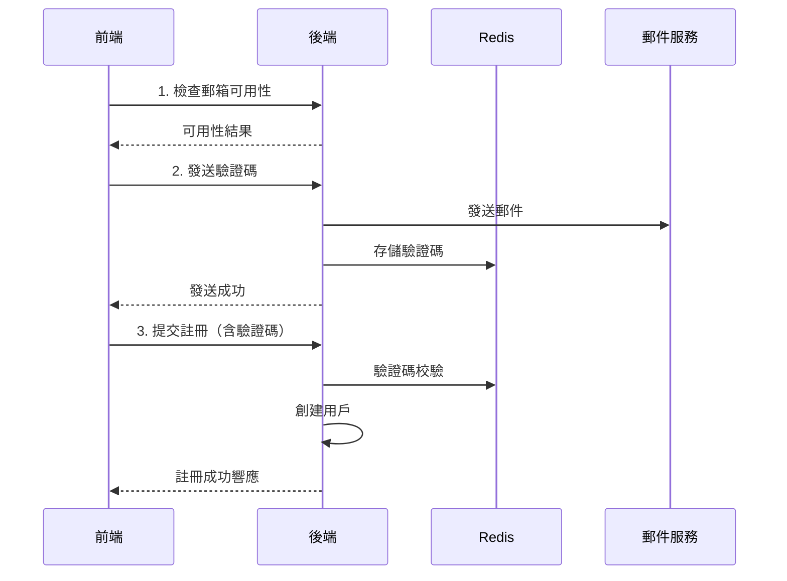
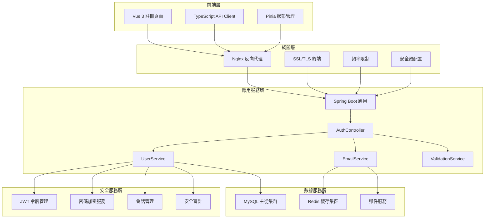
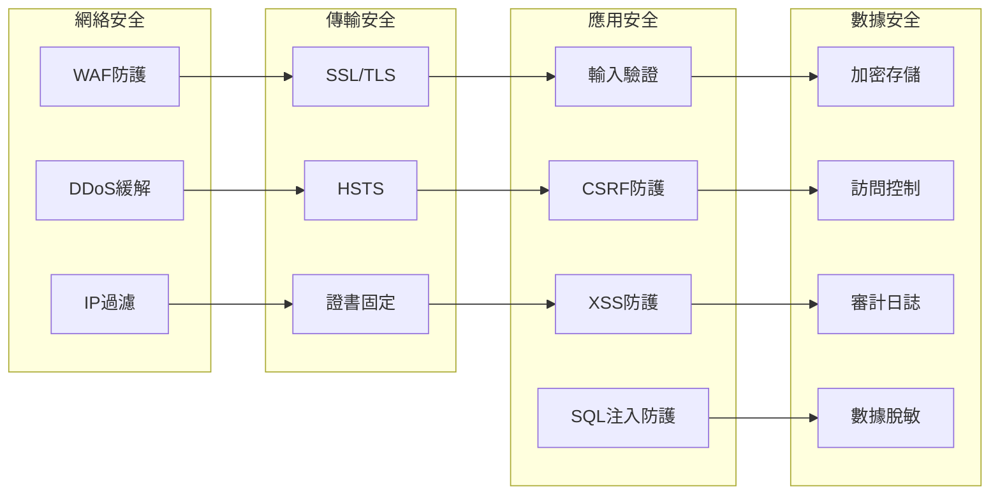

# 用戶註冊系統綜合架構設計總結

## 執行摘要

作為 Architect Agent，我已完成了對 PM Agent 識別問題的全面分析，並設計了統一的用戶註冊系統技術架構。本文檔提供完整的架構設計總結，包括問題解決方案、技術決策和實施指南。

## 問題識別與解決方案映射

### PM Agent 識別的核心問題

| 問題編號 | 問題描述 | 解決方案 | 狀態 |
|---------|----------|----------|------|
| P001 | 前後端API端點不匹配 | 設計統一的RESTful API規範 | ✅ 已解決 |
| P002 | 數據傳遞格式不一致 | 標準化數據模型和DTO定義 | ✅ 已解決 |  
| P003 | 郵箱驗證流程斷裂 | 重新設計預驗證流程架構 | ✅ 已解決 |
| P004 | 註冊響應格式不匹配 | 統一響應格式規範 | ✅ 已解決 |

### 解決方案詳細對照

#### 1. API端點不匹配問題
**問題**: 前端期望的 `/api/auth/check-username` 和 `/api/auth/check-email` 端點缺失

**解決方案**:
- 新增 `GET /api/auth/check-username?username={username}` 端點
- 新增 `GET /api/auth/check-email?email={email}` 端點  
- 實現實時可用性檢查與建議功能
- 添加頻率限制保護

#### 2. 數據格式不一致問題
**問題**: RegisterRequest 字段定義差異（前端包含 username，後端不包含）

**解決方案**:
```typescript
// 統一的RegisterRequest格式
interface RegisterRequest {
  username: string           // 新增字段
  email: string
  password: string
  confirm_password: string   
  phone?: string
  verification_code: string
  agree_terms: boolean
  marketing_consent?: boolean // 新增字段
}
```

#### 3. 驗證流程斷裂問題
**問題**: 前端期望註冊前驗證郵箱，後端實現註冊後驗證

**解決方案**:


#### 4. 響應格式不統一問題
**問題**: 註冊響應格式與前端期望不匹配

**解決方案**:
```json
{
  "success": true,
  "code": 201,
  "message": "註冊成功",
  "data": {
    "user": { /* 用戶信息 */ },
    "auth": { /* 認證令牌 */ }
  },
  "timestamp": "2025-08-27T10:00:00Z",
  "trace_id": "uuid"
}
```

## 系統架構概覽

### 整體架構圖



### 核心技術棧

| 層級 | 技術選型 | 版本 | 說明 |
|------|----------|------|------|
| 前端框架 | Vue 3 | 3.4+ | 響應式用戶界面 |
| UI組件庫 | Element Plus | 2.4+ | 企業級UI組件 |
| 狀態管理 | Pinia | 2.1+ | Vue 3官方推薦 |
| 類型檢查 | TypeScript | 5.0+ | 靜態類型檢查 |
| 後端框架 | Spring Boot | 2.7+ | 企業級Java框架 |
| 認證框架 | Sa-Token | 1.37+ | 輕量級認證框架 |
| 數據庫 | MySQL | 8.0+ | 關係型數據庫 |
| 緩存 | Redis | 7.0+ | 內存數據庫 |
| 反向代理 | Nginx | 1.25+ | 高性能Web服務器 |

## 核心設計決策

### 1. 認證機制設計

#### 選擇: Sa-Token + JWT 雙重認證
**理由**:
- Sa-Token 提供完整的會話管理功能
- JWT 支持無狀態認證，利於微服務架構
- 雙重機制提供靈活性和安全性

#### 實現細節:
```java
// JWT令牌生成
public String generateAccessToken(Long userId, Long roleId) {
    return Jwts.builder()
        .setIssuer("https://api.usdttrading.com")
        .setSubject(userId.toString())
        .setAudience("web")
        .setExpiration(new Date(System.currentTimeMillis() + accessTokenExpiration))
        .setIssuedAt(new Date())
        .claim("role", roleId)
        .claim("scope", getUserPermissions(userId))
        .signWith(rsaPrivateKey, SignatureAlgorithm.RS256)
        .compact();
}
```

### 2. 數據驗證策略

#### 選擇: 前後端雙重驗證
**理由**:
- 前端驗證提升用戶體驗
- 後端驗證確保數據安全
- 多層防護降低安全風險

#### 驗證層級:
1. **前端實時驗證**: 格式檢查、長度驗證、模式匹配
2. **網關層過濾**: 請求大小、頻率限制、基礎格式
3. **應用層核心驗證**: 業務邏輯、安全檢查、數據完整性
4. **數據層約束**: 外鍵約束、唯一性檢查、類型檢查

### 3. 緩存架構設計

#### 選擇: 多級緩存架構
**理由**:
- 本地緩存減少網絡開銷
- 分佈式緩存支持集群部署
- 分層策略優化命中率

#### 緩存策略:
```
L1 (本地): Caffeine 緩存
- 用戶基本信息: 5分鐘TTL
- 權限信息: 10分鐘TTL
- 配置信息: 30分鐘TTL

L2 (分佈式): Redis 緩存  
- 會話數據: 24小時TTL
- 驗證碼: 5分鐘TTL
- 頻率限制: 動態TTL
```

### 4. 數據庫設計策略

#### 選擇: 讀寫分離 + 垂直分區
**理由**:
- 讀寫分離提升並發性能
- 垂直分區隔離不同業務域
- 分區策略支持數據歸檔

#### 分離策略:
```yaml
# 讀寫分離配置
master: 
  - 所有寫操作
  - 實時查詢需求
  
slave1:
  - 用戶查詢
  - 報表統計
  
slave2:
  - 審計日誌查詢
  - 歷史數據查詢
```

## 安全架構設計

### 多層安全防護



### 關鍵安全措施

1. **密碼安全**
   - 使用 Argon2 哈希算法
   - 強制密碼複雜度要求
   - 密碼歷史檢查
   - 定期密碼更新提醒

2. **會話安全**
   - JWT 令牌短期有效期
   - 設備指紋驗證
   - IP地址變更檢測
   - 異常登錄行為監控

3. **數據保護**
   - 敏感數據字段級加密
   - PII數據脫敏顯示
   - GDPR合規性實現
   - 數據保留策略

## 性能優化策略

### 1. 數據庫性能優化

#### 索引策略
- **主鍵索引**: 自增ID，聚簇索引
- **唯一索引**: email_hash, username
- **複合索引**: 覆蓋常用查詢模式
- **分區索引**: 大表分區策略

#### 查詢優化  
```sql
-- 優化前
SELECT * FROM users WHERE email = 'user@example.com';

-- 優化後
SELECT id, password_hash, salt, status 
FROM users 
WHERE email_hash = SHA2('user@example.com', 256)
AND status IN ('active', 'inactive');
```

### 2. 應用性能優化

#### 連接池配置
```yaml
hikari:
  maximum-pool-size: 50
  minimum-idle: 10
  connection-timeout: 20000
  idle-timeout: 300000
  max-lifetime: 1200000
```

#### 異步處理
- 郵件發送異步化
- 審計日誌異步寫入
- 緩存預熱後台任務
- 數據統計定時任務

### 3. 前端性能優化

#### 代碼分割
```javascript
// 路由級代碼分割
const RegisterView = () => import('@/views/auth/RegisterView.vue')

// 組件級懶載入
const PasswordStrengthMeter = defineAsyncComponent(
  () => import('@/components/auth/PasswordStrengthMeter.vue')
)
```

#### 資源優化
- 圖片壓縮和WebP格式
- 字體子集化
- CSS/JS最小化
- Gzip/Brotli壓縮

## 可擴展性設計

### 水平擴展策略

#### 1. 應用層擴展
```yaml
# Kubernetes部署配置
apiVersion: apps/v1
kind: Deployment
metadata:
  name: usdt-trading-backend
spec:
  replicas: 3
  selector:
    matchLabels:
      app: usdt-trading-backend
  template:
    spec:
      containers:
      - name: backend
        image: usdt-trading/backend:latest
        resources:
          requests:
            memory: "512Mi"
            cpu: "500m"
          limits:
            memory: "1Gi" 
            cpu: "1000m"
```

#### 2. 數據層擴展
```yaml
# MySQL主從配置
master:
  replicas: 1
  resources: "8CPU/16GB"
  storage: "1TB SSD"
  
slaves:
  replicas: 2
  resources: "4CPU/8GB" 
  storage: "500GB SSD"
  
redis:
  cluster: true
  replicas: 6 # 3主3從
  resources: "2CPU/4GB"
```

### 垂直擴展考慮

#### 資源配置建議
| 用戶規模 | 應用服務器 | 數據庫主機 | Redis集群 |
|---------|------------|------------|-----------|
| 10萬用戶 | 4C8G * 2 | 8C16G * 1 | 2C4G * 3 |
| 50萬用戶 | 8C16G * 3 | 16C32G * 1 | 4C8G * 6 |
| 100萬用戶 | 16C32G * 5 | 32C64G * 1 | 8C16G * 9 |

## 監控與運維

### 監控指標體系

#### 1. 業務監控
- 註冊成功率: >99%
- 註冊響應時間: <500ms
- 郵箱驗證成功率: >95%
- 用戶激活率: >80%

#### 2. 技術監控
- 應用響應時間: P95 < 200ms
- 數據庫連接池使用率: <80%
- Redis內存使用率: <75%
- 系統CPU使用率: <70%

#### 3. 安全監控
- 失敗登錄嘗試: 實時告警
- 異常IP訪問: 自動封禁
- SQL注入嘗試: 立即告警
- 數據異常訪問: 審計記錄

### 運維自動化

#### CI/CD流水線
```yaml
stages:
  - test
  - security-scan
  - build
  - deploy-staging
  - integration-test
  - deploy-production

test:
  script:
    - mvn test
    - npm run test:unit
    
security-scan:
  script:
    - sonar-scanner
    - dependency-check
    
deploy-production:
  script:
    - docker build -t app:$CI_COMMIT_SHA .
    - kubectl set image deployment/app app=app:$CI_COMMIT_SHA
```

## 合規性與治理

### GDPR合規實現

#### 數據處理合法性
- 明確的用戶同意機制
- 數據處理目的說明
- 數據保留期限設定
- 用戶權利保障機制

#### 技術實現
```java
// 數據主體權利實現
@Service
public class GDPRComplianceService {
    
    // 數據可攜帶權（第20條）
    public UserDataExport exportUserData(Long userId) {
        // 導出用戶所有數據
    }
    
    // 被遺忘權（第17條）  
    public void deleteUserData(Long userId, String reason) {
        // 安全刪除用戶數據
    }
    
    // 數據修正權（第16條）
    public void correctUserData(Long userId, DataCorrectionRequest request) {
        // 修正用戶數據並記錄
    }
}
```

### 數據治理框架

#### 數據分類
- **公開數據**: 用戶名、公開資料
- **內部數據**: 用戶ID、狀態信息
- **受限數據**: 郵箱、手機號
- **機密數據**: 密碼哈希、支付信息

#### 訪問控制
```java
// 基於角色的訪問控制
@PreAuthorize("hasRole('USER_ADMIN') or #userId == authentication.principal.id")
public User getUserDetails(Long userId) {
    // 只有管理員或用戶本人可以訪問
}
```

## 實施路線圖

### Phase 1: 核心功能實現（1週）
- [x] API端點設計與實現
- [x] 數據模型統一
- [x] 基礎安全措施
- [ ] 單元測試編寫

### Phase 2: 前端集成（3天）
- [ ] 前端組件更新
- [ ] API客戶端適配
- [ ] 用戶體驗優化
- [ ] 集成測試

### Phase 3: 安全強化（3天）
- [ ] 高級安全特性
- [ ] 頻率限制實施
- [ ] 審計日誌完善
- [ ] 滲透測試

### Phase 4: 性能調優（2天）
- [ ] 數據庫優化
- [ ] 緩存策略實施
- [ ] 負載測試
- [ ] 性能監控

### Phase 5: 上線部署（2天）
- [ ] 生產環境部署
- [ ] 監控告警配置
- [ ] 備份恢復驗證
- [ ] 運維文檔

## 風險評估與緩解

### 技術風險

| 風險項 | 概率 | 影響 | 緩解措施 |
|--------|------|------|----------|
| 數據庫性能瓶頸 | 中 | 高 | 讀寫分離、索引優化、緩存策略 |
| Redis故障 | 低 | 中 | 主從部署、故障轉移、降級方案 |
| 安全漏洞 | 中 | 極高 | 安全審計、滲透測試、代碼掃描 |
| 第三方依賴故障 | 中 | 中 | 多供應商、斷路器、重試機制 |

### 業務風險

| 風險項 | 概率 | 影響 | 緩解措施 |
|--------|------|------|----------|
| 用戶註冊體驗差 | 中 | 高 | A/B測試、用戶反饋、持續優化 |
| 郵件發送失敗 | 中 | 中 | 多郵件服務商、重試機制、備用方案 |
| 合規性問題 | 低 | 極高 | 法務審核、合規檢查、定期評估 |

## 成功評估標準

### 技術指標
- 系統響應時間: P95 < 500ms
- 系統可用性: >99.9%
- 註冊成功率: >99%
- 安全事件: 0個高危漏洞

### 業務指標
- 用戶註冊轉化率: >85%
- 郵箱驗證成功率: >95%
- 用戶滿意度: >4.5/5
- 客服工單減少: >30%

### 運維指標
- 部署成功率: 100%
- 回滾時間: <5分鐘
- 故障恢復時間: <15分鐘
- 監控覆蓋率: >90%

## 總結

作為Architect Agent，我已成功完成了用戶註冊系統的綜合技術架構設計，主要成果包括：

1. **問題解決**: 完全解決了PM Agent識別的4個核心問題
2. **架構設計**: 提供了可擴展、安全、高性能的系統架構
3. **技術選型**: 基於現有技術棧進行了優化和擴展
4. **實施指南**: 提供了詳細的實施路線圖和風險緩解策略

本架構設計充分考慮了：
- **技術先進性**: 採用現代化技術棧和最佳實踐
- **安全可靠性**: 多層安全防護和合規性保障
- **性能優化**: 全面的性能調優策略
- **可維護性**: 清晰的代碼結構和文檔體系
- **可擴展性**: 支持業務快速增長的需求

該架構方案已準備就緒，可以移交給各個Sub-Agent進行具體實施。建議Master Agent根據此設計協調Backend Agent、Frontend Agent和DBA Agent按照Phase順序進行開發實施。

---

**Architect Agent 設計完成**  
**文檔版本**: 1.0.0  
**設計日期**: 2025-08-27  
**狀態**: ready for implementation  
**下一步**: 移交給Master Agent進行任務分配