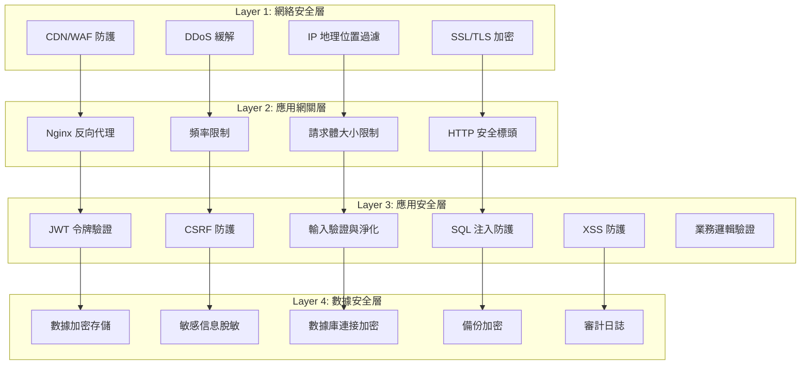
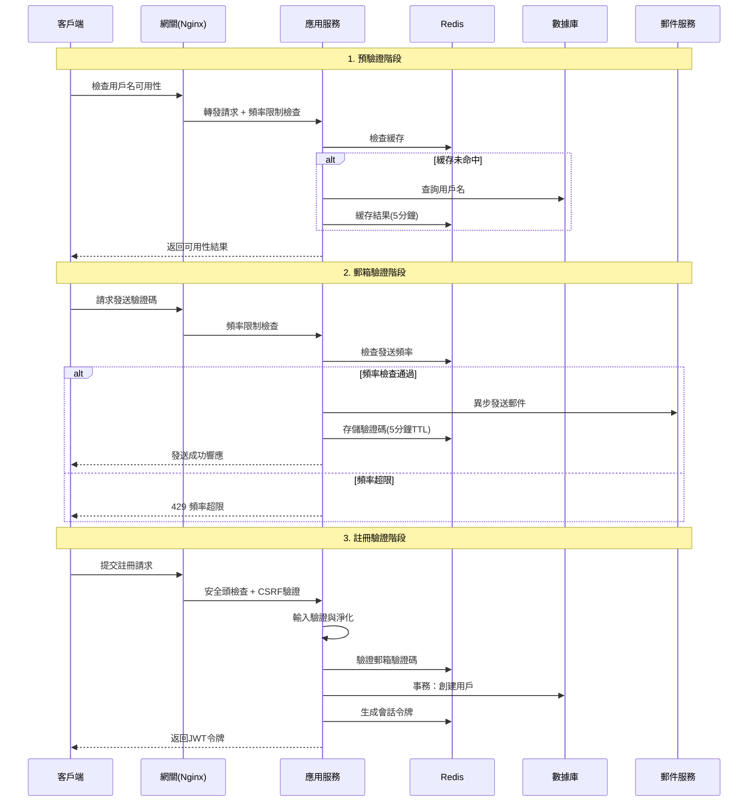

# 用戶註冊系統安全架構與驗證流程設計

## 安全架構概覽

### 多層安全防護體系



## 認證與授權架構

### 認證流程設計



### JWT 令牌安全設計

#### 令牌結構
```json
{
  "header": {
    "alg": "RS256",
    "typ": "JWT",
    "kid": "key-id-2025"
  },
  "payload": {
    "iss": "https://api.usdttrading.com",
    "sub": "123456",
    "aud": ["web", "mobile"],
    "exp": 1735660800,
    "iat": 1735657200,
    "nbf": 1735657200,
    "jti": "uuid-token-id",
    "scope": ["user:read", "user:write"],
    "role": "user",
    "email_verified": true,
    "mfa_verified": false,
    "device_id": "device-fingerprint-hash"
  }
}
```

#### 密鑰管理策略
```java
@Configuration
public class JwtSecurityConfig {
    
    @Value("${jwt.private-key-path}")
    private String privateKeyPath;
    
    @Value("${jwt.public-key-path}")
    private String publicKeyPath;
    
    // RSA 密鑰對配置
    @Bean
    public RSAPrivateKey privateKey() throws Exception {
        // 從加密的密鑰文件中加載私鑰
        // 使用環境變量或密鑰管理服務存儲密鑰密碼
        return loadPrivateKeyFromEncryptedFile(privateKeyPath);
    }
    
    @Bean
    public RSAPublicKey publicKey() throws Exception {
        return loadPublicKeyFromFile(publicKeyPath);
    }
    
    // 密鑰輪換策略
    @Scheduled(cron = "0 0 0 1 * ?") // 每月1號執行
    public void rotateKeys() {
        // 生成新的密鑰對
        // 更新密鑰存儲
        // 標記舊密鑰為待廢棄
        // 通知其他服務實例更新公鑰
    }
}
```

## 輸入驗證架構

### 多層驗證策略

#### 1. 前端驗證（用戶體驗層）
```typescript
// 實時驗證器
class RealtimeValidator {
  private validationRules: ValidationRules
  private debounceTimeout: number = 300
  
  // 用戶名驗證
  validateUsername(username: string): ValidationResult {
    const rules = {
      minLength: 4,
      maxLength: 20,
      pattern: /^[a-zA-Z0-9_]+$/,
      reservedWords: ['admin', 'system', 'root', 'api', 'www'],
      profanityFilter: true
    }
    
    return this.applyValidationRules(username, rules)
  }
  
  // 密碼強度驗證
  validatePassword(password: string): PasswordStrengthResult {
    const strength = {
      score: 0,
      feedback: [],
      requirements: {
        minLength: password.length >= 8,
        hasUppercase: /[A-Z]/.test(password),
        hasLowercase: /[a-z]/.test(password),
        hasNumbers: /\d/.test(password),
        hasSpecialChars: /[!@#$%^&*(),.?":{}|<>]/.test(password),
        noCommonPatterns: !this.hasCommonPatterns(password),
        noPersonalInfo: !this.containsPersonalInfo(password)
      }
    }
    
    // 計算強度分數
    strength.score = this.calculatePasswordScore(strength.requirements)
    
    return strength
  }
  
  private hasCommonPatterns(password: string): boolean {
    const commonPatterns = [
      /123456/,
      /password/i,
      /qwerty/i,
      /abc123/i,
      /admin/i,
      /letmein/i,
      /welcome/i
    ]
    
    return commonPatterns.some(pattern => pattern.test(password))
  }
  
  private containsPersonalInfo(password: string): boolean {
    // 檢查密碼是否包含已知的個人信息
    // 這裡可以與表單中的其他字段進行比較
    const formData = this.getFormData()
    const personalInfo = [
      formData.username?.toLowerCase(),
      formData.email?.split('@')[0]?.toLowerCase(),
      formData.phone?.replace(/\D/g, '').slice(-4)
    ].filter(Boolean)
    
    const lowerPassword = password.toLowerCase()
    return personalInfo.some(info => lowerPassword.includes(info))
  }
}
```

#### 2. 網關層驗證（流量過濾）
```nginx
# Nginx 配置
location /api/auth/ {
    # 基本安全頭
    add_header X-Frame-Options DENY always;
    add_header X-Content-Type-Options nosniff always;
    add_header X-XSS-Protection "1; mode=block" always;
    add_header Referrer-Policy strict-origin-when-cross-origin always;
    add_header Content-Security-Policy "default-src 'self'" always;
    
    # 請求體大小限制
    client_max_body_size 1M;
    
    # 頻率限制
    limit_req zone=auth_rate burst=10 nodelay;
    limit_req zone=per_ip burst=20 nodelay;
    
    # 防止慢速攻擊
    client_body_timeout 10s;
    client_header_timeout 10s;
    
    # 只允許特定方法
    if ($request_method !~ ^(GET|POST)$) {
        return 405;
    }
    
    proxy_pass http://backend;
}

# 頻率限制配置
http {
    limit_req_zone $binary_remote_addr zone=per_ip:10m rate=30r/m;
    limit_req_zone $binary_remote_addr zone=auth_rate:10m rate=10r/m;
}
```

#### 3. 應用層驗證（核心安全）
```java
@Component
@Validated
public class SecurityValidator {
    
    private final RedisTemplate<String, Object> redisTemplate;
    private final AuditLogService auditLogService;
    
    // 綜合安全驗證
    public SecurityValidationResult validateRegistration(
            RegisterRequest request, 
            HttpServletRequest httpRequest) {
        
        List<SecurityViolation> violations = new ArrayList<>();
        String clientIp = RequestUtils.getClientIp(httpRequest);
        String userAgent = RequestUtils.getUserAgent(httpRequest);
        
        // 1. IP 安全檢查
        violations.addAll(validateIpSecurity(clientIp));
        
        // 2. 設備指紋驗證
        violations.addAll(validateDeviceFingerprint(userAgent, httpRequest));
        
        // 3. 輸入安全檢查
        violations.addAll(validateInputSecurity(request));
        
        // 4. 行為模式分析
        violations.addAll(analyzeUserBehavior(clientIp, userAgent, request));
        
        // 5. 威脅情報檢查
        violations.addAll(checkThreatIntelligence(clientIp, request.getEmail()));
        
        // 記錄安全事件
        if (!violations.isEmpty()) {
            auditLogService.logSecurityViolation(clientIp, userAgent, violations);
        }
        
        return new SecurityValidationResult(violations.isEmpty(), violations);
    }
    
    private List<SecurityViolation> validateIpSecurity(String clientIp) {
        List<SecurityViolation> violations = new ArrayList<>();
        
        // IP 黑名單檢查
        if (isBlacklistedIp(clientIp)) {
            violations.add(new SecurityViolation("IP_BLACKLISTED", 
                "IP地址已被列入黑名單", SecurityLevel.HIGH));
        }
        
        // Tor 出口節點檢查
        if (isTorExitNode(clientIp)) {
            violations.add(new SecurityViolation("TOR_ACCESS_DETECTED", 
                "檢測到Tor網絡訪問", SecurityLevel.MEDIUM));
        }
        
        // 地理位置異常檢查
        String country = getCountryByIp(clientIp);
        if (isHighRiskCountry(country)) {
            violations.add(new SecurityViolation("HIGH_RISK_LOCATION", 
                "來自高風險地區的訪問", SecurityLevel.MEDIUM));
        }
        
        return violations;
    }
    
    private List<SecurityViolation> validateInputSecurity(RegisterRequest request) {
        List<SecurityViolation> violations = new ArrayList<>();
        
        // SQL 注入檢測
        String[] inputs = {request.getUsername(), request.getEmail(), request.getPhone()};
        for (String input : inputs) {
            if (input != null && containsSqlInjectionPattern(input)) {
                violations.add(new SecurityViolation("SQL_INJECTION_ATTEMPT", 
                    "檢測到SQL注入嘗試", SecurityLevel.HIGH));
                break;
            }
        }
        
        // XSS 攻擊檢測
        if (containsXssPattern(request.getUsername())) {
            violations.add(new SecurityViolation("XSS_ATTEMPT", 
                "檢測到XSS攻擊嘗試", SecurityLevel.HIGH));
        }
        
        // 異常字符檢測
        if (containsAbnormalCharacters(request.getUsername())) {
            violations.add(new SecurityViolation("ABNORMAL_CHARACTERS", 
                "用戶名包含異常字符", SecurityLevel.LOW));
        }
        
        return violations;
    }
    
    // SQL 注入模式檢測
    private boolean containsSqlInjectionPattern(String input) {
        String[] sqlPatterns = {
            "(?i).*(union|select|insert|delete|update|drop|exec|script).*",
            "(?i).*('|(\\-\\-)|(;)|(\\|)|(\\*)).*",
            "(?i).*(or\\s+1=1|and\\s+1=1).*",
            "(?i).*(exec\\s*\\().*"
        };
        
        return Arrays.stream(sqlPatterns)
                .anyMatch(pattern -> input.matches(pattern));
    }
    
    // XSS 模式檢測
    private boolean containsXssPattern(String input) {
        String[] xssPatterns = {
            "(?i).*<script.*?>.*</script>.*",
            "(?i).*javascript:.*",
            "(?i).*on(load|error|click|focus)=.*",
            "(?i).*<iframe.*?>.*",
            "(?i).*eval\\s*\\(.*"
        };
        
        return Arrays.stream(xssPatterns)
                .anyMatch(pattern -> input.matches(pattern));
    }
}
```

## 數據加密與保護

### 敏感數據加密策略

```java
@Service
public class DataEncryptionService {
    
    @Value("${encryption.key}")
    private String encryptionKey;
    
    @Value("${encryption.algorithm:AES/GCM/NoPadding}")
    private String algorithm;
    
    // 用戶敏感信息加密
    public String encryptSensitiveData(String plaintext) throws Exception {
        SecretKeySpec secretKey = new SecretKeySpec(
            encryptionKey.getBytes(), "AES");
        
        Cipher cipher = Cipher.getInstance(algorithm);
        
        // 生成隨機IV
        byte[] iv = new byte[12];
        SecureRandom.getInstanceStrong().nextBytes(iv);
        GCMParameterSpec gcmSpec = new GCMParameterSpec(128, iv);
        
        cipher.init(Cipher.ENCRYPT_MODE, secretKey, gcmSpec);
        byte[] encryptedData = cipher.doFinal(plaintext.getBytes(StandardCharsets.UTF_8));
        
        // 將IV和加密數據組合
        byte[] encryptedWithIv = new byte[iv.length + encryptedData.length];
        System.arraycopy(iv, 0, encryptedWithIv, 0, iv.length);
        System.arraycopy(encryptedData, 0, encryptedWithIv, iv.length, encryptedData.length);
        
        return Base64.getEncoder().encodeToString(encryptedWithIv);
    }
    
    // 用戶敏感信息解密
    public String decryptSensitiveData(String encryptedText) throws Exception {
        byte[] encryptedWithIv = Base64.getDecoder().decode(encryptedText);
        
        // 提取IV和加密數據
        byte[] iv = new byte[12];
        byte[] encryptedData = new byte[encryptedWithIv.length - 12];
        System.arraycopy(encryptedWithIv, 0, iv, 0, 12);
        System.arraycopy(encryptedWithIv, 12, encryptedData, 0, encryptedData.length);
        
        SecretKeySpec secretKey = new SecretKeySpec(encryptionKey.getBytes(), "AES");
        Cipher cipher = Cipher.getInstance(algorithm);
        GCMParameterSpec gcmSpec = new GCMParameterSpec(128, iv);
        
        cipher.init(Cipher.DECRYPT_MODE, secretKey, gcmSpec);
        byte[] decryptedData = cipher.doFinal(encryptedData);
        
        return new String(decryptedData, StandardCharsets.UTF_8);
    }
}

// 實體類字段加密
@Entity
public class User extends BaseEntity {
    
    private String username;
    private String email;
    
    @Convert(converter = EncryptedStringConverter.class)
    private String phone; // 加密存儲手機號
    
    @JsonIgnore
    private String passwordHash;
    
    @JsonIgnore
    private String salt;
    
    // 其他字段...
}

// 自定義加密轉換器
@Converter
public class EncryptedStringConverter implements AttributeConverter<String, String> {
    
    @Autowired
    private DataEncryptionService encryptionService;
    
    @Override
    public String convertToDatabaseColumn(String attribute) {
        if (attribute == null) return null;
        try {
            return encryptionService.encryptSensitiveData(attribute);
        } catch (Exception e) {
            throw new RuntimeException("加密失敗", e);
        }
    }
    
    @Override
    public String convertToEntityAttribute(String dbData) {
        if (dbData == null) return null;
        try {
            return encryptionService.decryptSensitiveData(dbData);
        } catch (Exception e) {
            throw new RuntimeException("解密失敗", e);
        }
    }
}
```

### 密碼安全策略

```java
@Component
public class PasswordSecurityService {
    
    // 密碼複雜度配置
    @Value("${password.min-length:8}")
    private int minLength;
    
    @Value("${password.max-length:128}")
    private int maxLength;
    
    @Value("${password.require-uppercase:true}")
    private boolean requireUppercase;
    
    @Value("${password.require-lowercase:true}")
    private boolean requireLowercase;
    
    @Value("${password.require-numbers:true}")
    private boolean requireNumbers;
    
    @Value("${password.require-special:true}")
    private boolean requireSpecialChars;
    
    // Argon2 密碼哈希
    public String hashPassword(String password) {
        Argon2 argon2 = Argon2Factory.create(Argon2Types.ARGON2id);
        return argon2.hash(
            4,      // iterations
            65536,  // memory in KB
            1,      // parallelism
            password.toCharArray()
        );
    }
    
    public boolean verifyPassword(String password, String hash) {
        Argon2 argon2 = Argon2Factory.create(Argon2Types.ARGON2id);
        return argon2.verify(hash, password.toCharArray());
    }
    
    // 密碼強度評估
    public PasswordStrengthResult evaluatePasswordStrength(String password) {
        int score = 0;
        List<String> feedback = new ArrayList<>();
        
        // 長度檢查
        if (password.length() < minLength) {
            feedback.add("密碼長度至少" + minLength + "位");
        } else if (password.length() >= 12) {
            score += 2;
        } else {
            score += 1;
        }
        
        // 字符類型檢查
        if (requireUppercase && !password.matches(".*[A-Z].*")) {
            feedback.add("需要包含大寫字母");
        } else if (password.matches(".*[A-Z].*")) {
            score += 1;
        }
        
        if (requireLowercase && !password.matches(".*[a-z].*")) {
            feedback.add("需要包含小寫字母");
        } else if (password.matches(".*[a-z].*")) {
            score += 1;
        }
        
        if (requireNumbers && !password.matches(".*\\d.*")) {
            feedback.add("需要包含數字");
        } else if (password.matches(".*\\d.*")) {
            score += 1;
        }
        
        if (requireSpecialChars && !password.matches(".*[!@#$%^&*(),.?\":{}|<>].*")) {
            feedback.add("需要包含特殊字符");
        } else if (password.matches(".*[!@#$%^&*(),.?\":{}|<>].*")) {
            score += 1;
        }
        
        // 模式檢查
        if (hasRepeatingPatterns(password)) {
            feedback.add("避免使用重複模式");
            score -= 1;
        }
        
        if (hasSequentialCharacters(password)) {
            feedback.add("避免使用連續字符");
            score -= 1;
        }
        
        // 字典檢查
        if (isCommonPassword(password)) {
            feedback.add("密碼過於常見，請選擇更複雜的密碼");
            score -= 2;
        }
        
        // 計算最終強度
        PasswordStrength strength;
        if (score >= 6) {
            strength = PasswordStrength.VERY_STRONG;
        } else if (score >= 4) {
            strength = PasswordStrength.STRONG;
        } else if (score >= 2) {
            strength = PasswordStrength.MEDIUM;
        } else {
            strength = PasswordStrength.WEAK;
        }
        
        return new PasswordStrengthResult(strength, score, feedback);
    }
    
    private boolean hasRepeatingPatterns(String password) {
        // 檢查3個或更多連續重複字符
        return password.matches(".*(..).*\\1.*") || 
               password.matches(".*(.)\\1{2,}.*");
    }
    
    private boolean hasSequentialCharacters(String password) {
        // 檢查連續字符序列
        String lower = password.toLowerCase();
        String[] sequences = {
            "abcdefghijklmnopqrstuvwxyz",
            "qwertyuiopasdfghjklzxcvbnm",
            "0123456789"
        };
        
        for (String seq : sequences) {
            for (int i = 0; i <= seq.length() - 3; i++) {
                String subseq = seq.substring(i, i + 3);
                if (lower.contains(subseq) || lower.contains(new StringBuilder(subseq).reverse().toString())) {
                    return true;
                }
            }
        }
        
        return false;
    }
    
    private boolean isCommonPassword(String password) {
        // 加載常見密碼列表
        Set<String> commonPasswords = loadCommonPasswordList();
        return commonPasswords.contains(password.toLowerCase());
    }
}
```

## 會話安全管理

### 會話生命周期管理

```java
@Service
public class SessionSecurityService {
    
    private final RedisTemplate<String, Object> redisTemplate;
    
    // 創建安全會話
    public UserSession createSecureSession(User user, HttpServletRequest request) {
        String sessionId = generateSecureSessionId();
        String deviceFingerprint = generateDeviceFingerprint(request);
        
        UserSession session = new UserSession();
        session.setSessionId(sessionId);
        session.setUserId(user.getId());
        session.setDeviceFingerprint(deviceFingerprint);
        session.setIpAddress(RequestUtils.getClientIp(request));
        session.setUserAgent(RequestUtils.getUserAgent(request));
        session.setCreatedAt(LocalDateTime.now());
        session.setLastAccessAt(LocalDateTime.now());
        session.setExpiresAt(LocalDateTime.now().plusHours(24));
        
        // 存儲到Redis
        String sessionKey = "user_session:" + sessionId;
        redisTemplate.opsForValue().set(sessionKey, session, 24, TimeUnit.HOURS);
        
        // 限制同時在線會話數量
        limitConcurrentSessions(user.getId(), sessionId);
        
        return session;
    }
    
    // 驗證會話安全性
    public boolean validateSession(String sessionId, HttpServletRequest request) {
        String sessionKey = "user_session:" + sessionId;
        UserSession session = (UserSession) redisTemplate.opsForValue().get(sessionKey);
        
        if (session == null) {
            return false; // 會話不存在
        }
        
        if (session.getExpiresAt().isBefore(LocalDateTime.now())) {
            redisTemplate.delete(sessionKey);
            return false; // 會話已過期
        }
        
        // IP地址變更檢查
        String currentIp = RequestUtils.getClientIp(request);
        if (!session.getIpAddress().equals(currentIp)) {
            if (isSuspiciousIpChange(session.getIpAddress(), currentIp)) {
                invalidateSession(sessionId);
                auditLogService.logSecurityEvent(session.getUserId(), 
                    "SUSPICIOUS_IP_CHANGE", "會話IP地址異常變更");
                return false;
            }
        }
        
        // 設備指紋驗證
        String currentFingerprint = generateDeviceFingerprint(request);
        if (!session.getDeviceFingerprint().equals(currentFingerprint)) {
            if (isSuspiciousDeviceChange(session.getDeviceFingerprint(), currentFingerprint)) {
                invalidateSession(sessionId);
                auditLogService.logSecurityEvent(session.getUserId(), 
                    "SUSPICIOUS_DEVICE_CHANGE", "會話設備指紋異常變更");
                return false;
            }
        }
        
        // 更新最後訪問時間
        session.setLastAccessAt(LocalDateTime.now());
        redisTemplate.opsForValue().set(sessionKey, session, 24, TimeUnit.HOURS);
        
        return true;
    }
    
    private void limitConcurrentSessions(Long userId, String newSessionId) {
        String userSessionsKey = "user_sessions:" + userId;
        Set<Object> existingSessions = redisTemplate.opsForSet().members(userSessionsKey);
        
        // 限制最大並發會話數
        final int maxConcurrentSessions = 5;
        
        if (existingSessions.size() >= maxConcurrentSessions) {
            // 找到最舊的會話並使其失效
            String oldestSession = findOldestSession(existingSessions);
            invalidateSession(oldestSession);
            redisTemplate.opsForSet().remove(userSessionsKey, oldestSession);
        }
        
        // 添加新會話
        redisTemplate.opsForSet().add(userSessionsKey, newSessionId);
        redisTemplate.expire(userSessionsKey, 24, TimeUnit.HOURS);
    }
    
    // 生成設備指紋
    private String generateDeviceFingerprint(HttpServletRequest request) {
        StringBuilder fingerprint = new StringBuilder();
        
        fingerprint.append(RequestUtils.getUserAgent(request));
        fingerprint.append("|");
        fingerprint.append(request.getHeader("Accept"));
        fingerprint.append("|");
        fingerprint.append(request.getHeader("Accept-Language"));
        fingerprint.append("|");
        fingerprint.append(request.getHeader("Accept-Encoding"));
        
        // 計算哈希值
        return DigestUtils.sha256Hex(fingerprint.toString());
    }
}
```

## 審計與監控

### 安全事件審計

```java
@Entity
@Table(name = "security_events")
public class SecurityEvent extends BaseEntity {
    
    @Column(name = "user_id")
    private Long userId;
    
    @Column(name = "event_type")
    @Enumerated(EnumType.STRING)
    private SecurityEventType eventType;
    
    @Column(name = "event_description")
    private String eventDescription;
    
    @Column(name = "ip_address")
    private String ipAddress;
    
    @Column(name = "user_agent")
    private String userAgent;
    
    @Column(name = "device_fingerprint")
    private String deviceFingerprint;
    
    @Column(name = "risk_level")
    @Enumerated(EnumType.STRING)
    private RiskLevel riskLevel;
    
    @Column(name = "additional_data", columnDefinition = "JSON")
    private String additionalData;
    
    @Column(name = "action_taken")
    private String actionTaken;
    
    // getters and setters
}

@Service
public class SecurityAuditService {
    
    private final SecurityEventMapper securityEventMapper;
    private final NotificationService notificationService;
    
    @Async
    public void logSecurityEvent(SecurityEventType eventType, Long userId, 
                                String description, String ipAddress, 
                                String userAgent, RiskLevel riskLevel,
                                Map<String, Object> additionalData) {
        
        SecurityEvent event = new SecurityEvent();
        event.setUserId(userId);
        event.setEventType(eventType);
        event.setEventDescription(description);
        event.setIpAddress(ipAddress);
        event.setUserAgent(userAgent);
        event.setRiskLevel(riskLevel);
        
        if (additionalData != null) {
            try {
                event.setAdditionalData(objectMapper.writeValueAsString(additionalData));
            } catch (Exception e) {
                log.warn("序列化附加數據失敗", e);
            }
        }
        
        securityEventMapper.insert(event);
        
        // 高風險事件實時告警
        if (riskLevel == RiskLevel.HIGH || riskLevel == RiskLevel.CRITICAL) {
            sendSecurityAlert(event);
        }
        
        // 觸發自動化響應
        triggerAutomatedResponse(event);
    }
    
    private void triggerAutomatedResponse(SecurityEvent event) {
        switch (event.getEventType()) {
            case MULTIPLE_LOGIN_FAILURES:
                handleMultipleLoginFailures(event);
                break;
            case SUSPICIOUS_LOCATION_ACCESS:
                handleSuspiciousLocationAccess(event);
                break;
            case POTENTIAL_BOT_ACTIVITY:
                handlePotentialBotActivity(event);
                break;
            case SQL_INJECTION_ATTEMPT:
            case XSS_ATTEMPT:
                handleInjectionAttempt(event);
                break;
        }
    }
    
    private void handleMultipleLoginFailures(SecurityEvent event) {
        String ipAddress = event.getIpAddress();
        
        // 臨時封禁IP
        String blacklistKey = "ip_blacklist:" + ipAddress;
        redisTemplate.opsForValue().set(blacklistKey, "temporarily_blocked", 1, TimeUnit.HOURS);
        
        // 如果是已註冊用戶，鎖定賬戶
        if (event.getUserId() != null) {
            userService.temporaryLockUser(event.getUserId(), Duration.ofMinutes(30));
        }
        
        event.setActionTaken("IP臨時封禁1小時，用戶賬戶臨時鎖定30分鐘");
        securityEventMapper.updateById(event);
    }
    
    private void handleInjectionAttempt(SecurityEvent event) {
        String ipAddress = event.getIpAddress();
        
        // 永久封禁惡意IP
        String blacklistKey = "ip_blacklist:" + ipAddress;
        redisTemplate.opsForValue().set(blacklistKey, "permanently_blocked");
        
        // 立即告警
        sendCriticalSecurityAlert(event);
        
        event.setActionTaken("IP永久封禁，已發送緊急告警");
        securityEventMapper.updateById(event);
    }
}
```

### 實時威脅檢測

```java
@Component
public class ThreatDetectionEngine {
    
    private final RedisTemplate<String, Object> redisTemplate;
    private final SecurityAuditService auditService;
    
    // 異常行為檢測
    @EventListener
    public void detectAnomalousActivity(UserActionEvent event) {
        String userId = event.getUserId().toString();
        String actionType = event.getActionType();
        
        // 統計用戶行為模式
        String behaviorKey = "user_behavior:" + userId + ":" + actionType;
        String hourKey = behaviorKey + ":" + getCurrentHour();
        
        Long actionCount = redisTemplate.opsForValue().increment(hourKey);
        if (actionCount == 1) {
            redisTemplate.expire(hourKey, 1, TimeUnit.HOURS);
        }
        
        // 檢測異常頻率
        if (isAnomalousFrequency(actionType, actionCount)) {
            auditService.logSecurityEvent(
                SecurityEventType.ANOMALOUS_BEHAVIOR,
                event.getUserId(),
                "檢測到異常行為頻率: " + actionType,
                event.getIpAddress(),
                event.getUserAgent(),
                RiskLevel.MEDIUM,
                Map.of("action_count", actionCount, "time_window", "1hour")
            );
        }
    }
    
    // 分佈式攻擊檢測
    public void detectDistributedAttack(String endpoint, String ipAddress) {
        String endpointKey = "endpoint_access:" + endpoint;
        String minuteKey = endpointKey + ":" + getCurrentMinute();
        
        // 統計端點訪問頻率
        redisTemplate.opsForZSet().add(minuteKey, ipAddress, System.currentTimeMillis());
        redisTemplate.expire(minuteKey, 1, TimeUnit.MINUTES);
        
        // 檢查是否存在分佈式攻擊
        Long uniqueIps = redisTemplate.opsForZSet().count(minuteKey, Double.NEGATIVE_INFINITY, Double.POSITIVE_INFINITY);
        if (uniqueIps > 100) { // 1分鐘內超過100個不同IP訪問同一端點
            auditService.logSecurityEvent(
                SecurityEventType.POTENTIAL_DDOS,
                null,
                "檢測到潛在的分佈式攻擊",
                null,
                null,
                RiskLevel.CRITICAL,
                Map.of("endpoint", endpoint, "unique_ips", uniqueIps)
            );
            
            // 觸發DDoS防護
            activateDDoSProtection(endpoint);
        }
    }
    
    private void activateDDoSProtection(String endpoint) {
        // 實施更嚴格的頻率限制
        String protectionKey = "ddos_protection:" + endpoint;
        redisTemplate.opsForValue().set(protectionKey, "active", 10, TimeUnit.MINUTES);
        
        // 通知運維團隊
        notificationService.sendCriticalAlert(
            "DDoS Protection Activated",
            "Endpoint: " + endpoint + " is under potential attack"
        );
    }
}
```

## 合規性和隱私保護

### GDPR 合規性實現

```java
@Service
public class PrivacyComplianceService {
    
    // 數據最小化原則
    public UserDataView getMinimalUserData(Long userId, String purpose) {
        User user = userService.getById(userId);
        
        switch (purpose) {
            case "authentication":
                return UserDataView.builder()
                    .id(user.getId())
                    .email(user.getEmail())
                    .status(user.getStatus())
                    .build();
                    
            case "profile_display":
                return UserDataView.builder()
                    .id(user.getId())
                    .username(user.getUsername())
                    .email(maskEmail(user.getEmail()))
                    .phone(maskPhone(user.getPhone()))
                    .build();
                    
            default:
                throw new IllegalArgumentException("未授權的數據訪問目的");
        }
    }
    
    // 數據脫敏
    private String maskEmail(String email) {
        if (email == null) return null;
        String[] parts = email.split("@");
        if (parts.length != 2) return email;
        
        String localPart = parts[0];
        String domain = parts[1];
        
        if (localPart.length() <= 2) {
            return "*".repeat(localPart.length()) + "@" + domain;
        }
        
        return localPart.charAt(0) + "*".repeat(localPart.length() - 2) + 
               localPart.charAt(localPart.length() - 1) + "@" + domain;
    }
    
    // 數據保留策略
    @Scheduled(cron = "0 2 * * * *") // 每天凌晨2點執行
    public void enforceDataRetention() {
        // 刪除過期的審計日誌（保留2年）
        LocalDateTime retentionCutoff = LocalDateTime.now().minusYears(2);
        auditLogService.deleteLogsOlderThan(retentionCutoff);
        
        // 匿名化非活躍用戶數據（3年未登錄）
        LocalDateTime inactiveCutoff = LocalDateTime.now().minusYears(3);
        List<User> inactiveUsers = userService.findUsersNotLoggedInSince(inactiveCutoff);
        
        for (User user : inactiveUsers) {
            anonymizeUserData(user);
        }
    }
    
    // 用戶數據匿名化
    private void anonymizeUserData(User user) {
        user.setEmail("anonymous_" + user.getId() + "@deleted.local");
        user.setPhone(null);
        user.setUsername("anonymous_" + user.getId());
        user.setPasswordHash("ANONYMIZED");
        user.setSalt("ANONYMIZED");
        
        userService.updateUser(user);
        
        // 記錄匿名化操作
        auditLogService.logDataProcessing(user.getId(), "DATA_ANONYMIZATION", 
            "用戶數據已根據保留政策匿名化");
    }
    
    // 數據導出（GDPR第20條 - 數據可攜帶權）
    public UserDataExport exportUserData(Long userId) {
        User user = userService.getById(userId);
        UserProfile profile = userProfileService.getByUserId(userId);
        List<AuditLog> auditLogs = auditLogService.getByUserId(userId);
        
        return UserDataExport.builder()
            .user(user)
            .profile(profile)
            .auditLogs(auditLogs)
            .exportDate(LocalDateTime.now())
            .format("JSON")
            .build();
    }
    
    // 數據刪除（GDPR第17條 - 被遺忘權）
    @Transactional
    public void deleteUserData(Long userId, String deletionReason) {
        // 驗證刪除請求的合法性
        validateDeletionRequest(userId, deletionReason);
        
        // 軟刪除用戶數據
        User user = userService.getById(userId);
        user.setStatus(UserStatus.DELETED);
        user.setEmail("deleted_" + userId + "@deleted.local");
        user.setPhone(null);
        user.setPasswordHash("DELETED");
        userService.updateUser(user);
        
        // 記錄刪除操作
        auditLogService.logDataProcessing(userId, "DATA_DELETION", 
            "用戶行使被遺忘權，數據已刪除。原因: " + deletionReason);
        
        // 30天後物理刪除
        scheduledDeletionService.schedulePhysicalDeletion(userId, 30);
    }
}
```

---

**文檔版本**: 1.0.0  
**最後更新**: 2025-08-27  
**負責人**: Architect Agent  
**安全等級**: 機密