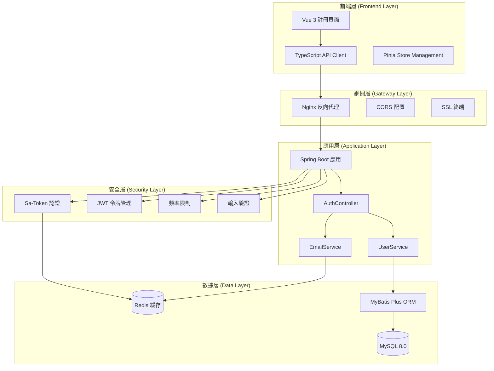
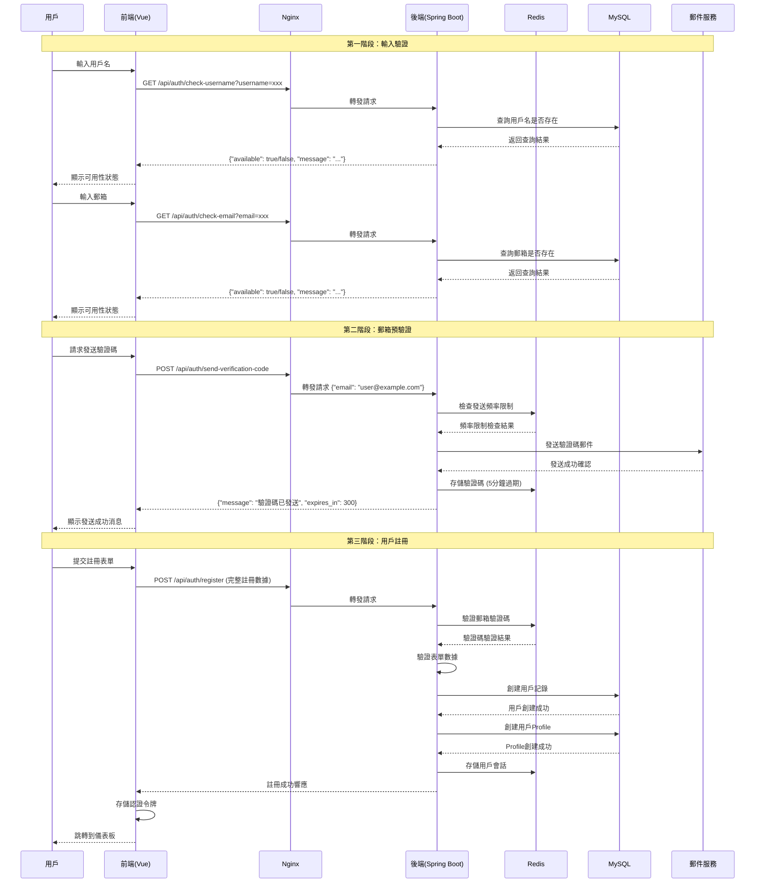
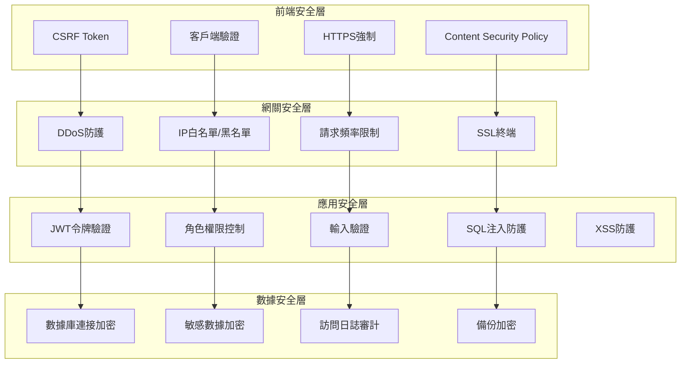

# 用戶註冊系統技術架構設計

## 執行背景

### Master Agent 指派任務
基於PM Agent的問題識別報告，需要設計統一的用戶註冊系統技術架構，解決當前前後端API不匹配和流程不一致的問題。

### 識別的主要問題
1. **API端點不匹配**: 前端期望的 `check-username` 和 `check-email` 端點缺失
2. **數據格式不一致**: RegisterRequest 字段定義差異（前端包含 username 字段，後端不包含）
3. **驗證流程斷裂**: 前端期望註冊前驗證郵箱，後端實現註冊後驗證
4. **響應格式不統一**: 註冊響應格式與前端期望不匹配

### 當前技術棧分析
- **後端**: Spring Boot 2.7 + Sa-Token + Redis + MySQL 8.0 + Java 11
- **前端**: Vue 3 + Element Plus + TypeScript + Vite
- **認證機制**: Sa-Token + JWT 雙重認證
- **數據存儲**: MySQL (主數據) + Redis (緩存/會話)

## 系統架構設計

### 1. 整體架構概覽



### 2. 註冊流程時序架構



### 3. API接口設計規範

#### 3.1 統一響應格式

```json
{
  "success": true,
  "code": 200,
  "message": "操作成功",
  "data": {},
  "timestamp": "2025-08-27T10:00:00Z",
  "trace_id": "uuid-trace-id"
}
```

#### 3.2 錯誤響應格式

```json
{
  "success": false,
  "code": 400,
  "message": "請求參數錯誤",
  "errors": [
    {
      "field": "email",
      "code": "INVALID_FORMAT",
      "message": "郵箱格式不正確"
    }
  ],
  "timestamp": "2025-08-27T10:00:00Z",
  "trace_id": "uuid-trace-id"
}
```

#### 3.3 核心API端點定義

##### 用戶名可用性檢查
```
GET /api/auth/check-username?username={username}

Response:
{
  "success": true,
  "data": {
    "available": true,
    "username": "john_doe",
    "suggestions": ["john_doe1", "john_doe2"] // 如果不可用時提供建議
  }
}
```

##### 郵箱可用性檢查
```
GET /api/auth/check-email?email={email}

Response:
{
  "success": true,
  "data": {
    "available": true,
    "email": "user@example.com",
    "verified": false
  }
}
```

##### 發送郵箱驗證碼
```
POST /api/auth/send-verification-code
Content-Type: application/json

Request:
{
  "email": "user@example.com",
  "type": "registration" // registration, reset_password, change_email
}

Response:
{
  "success": true,
  "data": {
    "message": "驗證碼已發送",
    "expires_in": 300,
    "can_resend_after": 60
  }
}
```

##### 用戶註冊
```
POST /api/auth/register
Content-Type: application/json

Request:
{
  "username": "john_doe",
  "email": "user@example.com",
  "password": "SecurePass123!",
  "phone": "+1234567890", // 可選
  "verification_code": "123456",
  "agree_terms": true,
  "marketing_consent": false // 可選
}

Response:
{
  "success": true,
  "data": {
    "user": {
      "id": 123,
      "username": "john_doe",
      "email": "user@example.com",
      "status": "active",
      "email_verified": true,
      "created_at": "2025-08-27T10:00:00Z"
    },
    "auth": {
      "access_token": "jwt-token",
      "refresh_token": "refresh-token",
      "expires_in": 3600,
      "token_type": "Bearer"
    }
  }
}
```

## 4. 數據模型設計

### 4.1 用戶表結構優化

```sql
CREATE TABLE users (
    id BIGINT PRIMARY KEY AUTO_INCREMENT,
    username VARCHAR(50) UNIQUE NOT NULL COMMENT '用戶名',
    email VARCHAR(255) UNIQUE NOT NULL COMMENT '郵箱地址',
    phone VARCHAR(20) UNIQUE NULL COMMENT '手機號碼',
    password_hash VARCHAR(255) NOT NULL COMMENT '密碼哈希',
    salt VARCHAR(32) NOT NULL COMMENT '密碼鹽值',
    status ENUM('inactive', 'active', 'suspended', 'locked') DEFAULT 'active' COMMENT '用戶狀態',
    email_verified BOOLEAN DEFAULT FALSE COMMENT '郵箱驗證狀態',
    phone_verified BOOLEAN DEFAULT FALSE COMMENT '手機驗證狀態',
    mfa_enabled BOOLEAN DEFAULT FALSE COMMENT 'MFA啟用狀態',
    role_id BIGINT NOT NULL DEFAULT 3 COMMENT '角色ID',
    last_login_at TIMESTAMP NULL COMMENT '最後登錄時間',
    last_login_ip VARCHAR(45) NULL COMMENT '最後登錄IP',
    login_attempts INT DEFAULT 0 COMMENT '登錄嘗試次數',
    locked_until TIMESTAMP NULL COMMENT '鎖定到期時間',
    created_at TIMESTAMP DEFAULT CURRENT_TIMESTAMP,
    updated_at TIMESTAMP DEFAULT CURRENT_TIMESTAMP ON UPDATE CURRENT_TIMESTAMP,
    
    INDEX idx_email (email),
    INDEX idx_username (username),
    INDEX idx_phone (phone),
    INDEX idx_status (status),
    INDEX idx_created_at (created_at)
) ENGINE=InnoDB DEFAULT CHARSET=utf8mb4 COLLATE=utf8mb4_unicode_ci;
```

### 4.2 Redis緩存設計

```
# 驗證碼存儲
verification_code:{email}:{type} -> {
  "code": "123456",
  "attempts": 0,
  "created_at": timestamp,
  "expires_at": timestamp
} TTL: 300秒

# 頻率限制
rate_limit:verification:{email} -> count TTL: 3600秒
rate_limit:registration:{ip} -> count TTL: 3600秒
rate_limit:username_check:{ip} -> count TTL: 60秒

# 會話管理
user_session:{user_id} -> {
  "access_token": "jwt-token",
  "refresh_token": "refresh-token",
  "device_info": {...},
  "created_at": timestamp
} TTL: 7天

# JWT黑名單
jwt_blacklist:{token_hash} -> "revoked" TTL: token過期時間
```

## 5. 安全架構設計

### 5.1 多層安全防護



### 5.2 輸入驗證策略

#### 前端驗證（第一道防線）
```typescript
// 用戶名驗證
const validateUsername = (username: string): ValidationResult => {
  const rules = {
    minLength: 4,
    maxLength: 20,
    pattern: /^[a-zA-Z0-9_]+$/,
    reservedWords: ['admin', 'system', 'root', 'api']
  }
  
  if (username.length < rules.minLength) {
    return { valid: false, message: '用戶名至少4個字符' }
  }
  
  if (username.length > rules.maxLength) {
    return { valid: false, message: '用戶名最多20個字符' }
  }
  
  if (!rules.pattern.test(username)) {
    return { valid: false, message: '用戶名只能包含字母、數字和下劃線' }
  }
  
  if (rules.reservedWords.includes(username.toLowerCase())) {
    return { valid: false, message: '該用戶名不可用' }
  }
  
  return { valid: true, message: '用戶名可用' }
}

// 密碼強度驗證
const validatePassword = (password: string): ValidationResult => {
  const rules = {
    minLength: 8,
    maxLength: 128,
    requireUppercase: true,
    requireLowercase: true,
    requireNumbers: true,
    requireSpecialChars: true,
    forbiddenPatterns: [
      /12345678/,
      /password/i,
      /qwerty/i
    ]
  }
  
  // 實施複雜的密碼驗證邏輯
  return validatePasswordStrength(password, rules)
}
```

#### 後端驗證（核心防線）
```java
@Component
public class RegisterRequestValidator {
    
    @Value("${app.security.password.min-length:8}")
    private int passwordMinLength;
    
    @Value("${app.security.username.min-length:4}")
    private int usernameMinLength;
    
    private static final Pattern EMAIL_PATTERN = Pattern.compile(
        "^[A-Za-z0-9+_.-]+@([A-Za-z0-9.-]+\\.[A-Za-z]{2,})$"
    );
    
    private static final Pattern USERNAME_PATTERN = Pattern.compile(
        "^[a-zA-Z0-9_]{4,20}$"
    );
    
    private static final Set<String> RESERVED_USERNAMES = Set.of(
        "admin", "administrator", "system", "root", "api", "support"
    );
    
    public ValidationResult validateRegisterRequest(RegisterRequest request) {
        List<ValidationError> errors = new ArrayList<>();
        
        // 驗證用戶名
        if (!USERNAME_PATTERN.matcher(request.getUsername()).matches()) {
            errors.add(new ValidationError("username", "INVALID_FORMAT", 
                "用戶名格式不正確"));
        }
        
        if (RESERVED_USERNAMES.contains(request.getUsername().toLowerCase())) {
            errors.add(new ValidationError("username", "RESERVED", 
                "該用戶名不可用"));
        }
        
        // 驗證郵箱
        if (!EMAIL_PATTERN.matcher(request.getEmail()).matches()) {
            errors.add(new ValidationError("email", "INVALID_FORMAT", 
                "郵箱格式不正確"));
        }
        
        // 驗證密碼強度
        PasswordStrengthResult strengthResult = passwordEncoder.checkStrength(
            request.getPassword());
        if (!strengthResult.isStrong()) {
            errors.add(new ValidationError("password", "WEAK_PASSWORD", 
                strengthResult.getMessage()));
        }
        
        return new ValidationResult(errors.isEmpty(), errors);
    }
}
```

### 5.3 頻率限制策略

```java
@Component
public class RateLimitService {
    
    private final RedisTemplate<String, Object> redisTemplate;
    
    // 註冊頻率限制：每個IP每小時最多3次註冊嘗試
    public boolean checkRegistrationRate(String clientIp) {
        String key = "rate_limit:registration:" + clientIp;
        String hourKey = key + ":" + getCurrentHour();
        
        Long count = redisTemplate.opsForValue().increment(hourKey);
        if (count == 1) {
            redisTemplate.expire(hourKey, 1, TimeUnit.HOURS);
        }
        
        return count <= 3;
    }
    
    // 驗證碼發送頻率限制：每個郵箱每分鐘最多1次
    public boolean checkVerificationCodeRate(String email) {
        String key = "rate_limit:verification:" + email;
        String minuteKey = key + ":" + getCurrentMinute();
        
        Long count = redisTemplate.opsForValue().increment(minuteKey);
        if (count == 1) {
            redisTemplate.expire(minuteKey, 1, TimeUnit.MINUTES);
        }
        
        return count <= 1;
    }
    
    // 用戶名/郵箱檢查頻率限制：每個IP每分鐘最多20次
    public boolean checkAvailabilityRate(String clientIp) {
        String key = "rate_limit:availability:" + clientIp;
        String minuteKey = key + ":" + getCurrentMinute();
        
        Long count = redisTemplate.opsForValue().increment(minuteKey);
        if (count == 1) {
            redisTemplate.expire(minuteKey, 1, TimeUnit.MINUTES);
        }
        
        return count <= 20;
    }
}
```

## 6. 數據庫優化策略

### 6.1 索引策略
```sql
-- 主要索引
ALTER TABLE users ADD INDEX idx_email (email);
ALTER TABLE users ADD INDEX idx_username (username);  
ALTER TABLE users ADD INDEX idx_phone (phone);
ALTER TABLE users ADD INDEX idx_status_created (status, created_at);

-- 複合索引優化查詢性能
ALTER TABLE users ADD INDEX idx_email_status (email, status);
ALTER TABLE users ADD INDEX idx_login_attempts_locked (login_attempts, locked_until);

-- 全文索引（如果需要用戶搜索功能）
ALTER TABLE users ADD FULLTEXT(username, email);
```

### 6.2 分區策略
```sql
-- 按創建時間分區（適用於大量用戶場景）
ALTER TABLE users PARTITION BY RANGE (YEAR(created_at)) (
    PARTITION p2024 VALUES LESS THAN (2025),
    PARTITION p2025 VALUES LESS THAN (2026),
    PARTITION p2026 VALUES LESS THAN (2027),
    PARTITION p_future VALUES LESS THAN MAXVALUE
);
```

### 6.3 讀寫分離配置
```yaml
# application.yml
spring:
  shardingsphere:
    datasource:
      names: master,slave1,slave2
      master:
        type: com.zaxxer.hikari.HikariDataSource
        driver-class-name: com.mysql.cj.jdbc.Driver
        jdbc-url: jdbc:mysql://mysql-master:3306/usdt_trading
        username: ${DB_USER}
        password: ${DB_PASSWORD}
      slave1:
        type: com.zaxxer.hikari.HikariDataSource
        driver-class-name: com.mysql.cj.jdbc.Driver
        jdbc-url: jdbc:mysql://mysql-slave1:3306/usdt_trading
        username: ${DB_USER}
        password: ${DB_PASSWORD}
      slave2:
        type: com.zaxxer.hikari.HikariDataSource
        driver-class-name: com.mysql.cj.jdbc.Driver
        jdbc-url: jdbc:mysql://mysql-slave2:3306/usdt_trading
        username: ${DB_USER}
        password: ${DB_PASSWORD}
    rules:
      readwrite-splitting:
        data-sources:
          userdb:
            write-data-source-name: master
            read-data-source-names: slave1,slave2
            load-balancer-name: round_robin
```

## 7. 監控和日誌策略

### 7.1 關鍵指標監控
```yaml
# Prometheus監控指標
metrics:
  user_registration:
    - name: registration_attempts_total
      type: counter
      labels: [status, source]
    - name: registration_duration_seconds
      type: histogram
      buckets: [0.1, 0.5, 1.0, 2.0, 5.0]
    - name: email_verification_rate
      type: gauge
    - name: username_availability_checks_total  
      type: counter
      labels: [result]
      
  security:
    - name: rate_limit_exceeded_total
      type: counter
      labels: [endpoint, ip]
    - name: invalid_credentials_total
      type: counter
      labels: [source]
    - name: account_lockouts_total
      type: counter
```

### 7.2 審計日誌設計
```java
@Entity
public class AuditLog {
    private Long id;
    private Long userId;
    private String action; // REGISTER, LOGIN, PASSWORD_CHANGE等
    private String resource; // users, profiles等
    private String resourceId;
    private String description;
    private String ipAddress;
    private String userAgent;
    private Object oldValue;
    private Object newValue;
    private Boolean success;
    private String errorMessage;
    private LocalDateTime timestamp;
    private String traceId;
}

// 使用AOP記錄關鍵操作
@Aspect
@Component
public class AuditAspect {
    
    @Around("@annotation(Auditable)")
    public Object auditMethod(ProceedingJoinPoint joinPoint, Auditable auditable) {
        // 記錄操作前狀態
        // 執行操作
        // 記錄操作後狀態和結果
        // 異步寫入審計日誌
    }
}
```

## 8. 性能優化策略

### 8.1 緩存策略
```java
@Configuration
@EnableCaching
public class CacheConfig {
    
    @Bean
    public CacheManager cacheManager() {
        RedisCacheManager.Builder builder = RedisCacheManager
            .RedisCacheManagerBuilder
            .fromConnectionFactory(redisConnectionFactory())
            .cacheDefaults(cacheConfiguration());
        
        return builder.build();
    }
    
    private RedisCacheConfiguration cacheConfiguration() {
        return RedisCacheConfiguration.defaultCacheConfig()
            .entryTtl(Duration.ofMinutes(10))
            .serializeKeysWith(RedisSerializationContext.SerializationPair
                .fromSerializer(new StringRedisSerializer()))
            .serializeValuesWith(RedisSerializationContext.SerializationPair
                .fromSerializer(new GenericJackson2JsonRedisSerializer()));
    }
}

// 用戶信息緩存
@Cacheable(value = "users", key = "#userId", unless = "#result == null")
public User getUserById(Long userId) {
    return userMapper.selectById(userId);
}

// 用戶名/郵箱存在性檢查緩存（短期）
@Cacheable(value = "availability", key = "'username:' + #username", 
           unless = "#result == null")
public Boolean checkUsernameExists(String username) {
    return userMapper.existsByUsername(username);
}
```

### 8.2 異步處理
```java
@Configuration
@EnableAsync
public class AsyncConfig {
    
    @Bean("emailTaskExecutor")
    public TaskExecutor emailTaskExecutor() {
        ThreadPoolTaskExecutor executor = new ThreadPoolTaskExecutor();
        executor.setCorePoolSize(5);
        executor.setMaxPoolSize(10);
        executor.setQueueCapacity(25);
        executor.setThreadNamePrefix("email-");
        executor.initialize();
        return executor;
    }
}

@Service
public class EmailService {
    
    @Async("emailTaskExecutor")
    public CompletableFuture<Void> sendVerificationEmailAsync(
            String email, String code) {
        try {
            sendVerificationEmail(email, code);
            return CompletableFuture.completedFuture(null);
        } catch (Exception e) {
            return CompletableFuture.failedFuture(e);
        }
    }
}
```

## 9. 部署和維護策略

### 9.1 Docker化部署
```dockerfile
# 後端應用Dockerfile
FROM openjdk:11-jre-slim

WORKDIR /app
COPY target/usdt-trading-backend.jar app.jar

# 健康檢查
HEALTHCHECK --interval=30s --timeout=10s --start-period=60s --retries=3 \
  CMD curl -f http://localhost:8080/actuator/health || exit 1

EXPOSE 8080
ENTRYPOINT ["java", "-jar", "app.jar"]
```

```yaml
# docker-compose.yml
version: '3.8'
services:
  backend:
    build: ./backend
    environment:
      - SPRING_PROFILES_ACTIVE=prod
      - DB_HOST=mysql
      - REDIS_HOST=redis
    depends_on:
      - mysql
      - redis
    healthcheck:
      test: ["CMD", "curl", "-f", "http://localhost:8080/actuator/health"]
      interval: 30s
      timeout: 10s
      retries: 3
      
  frontend:
    build: ./frontend/user
    ports:
      - "80:80"
    depends_on:
      - backend
      
  mysql:
    image: mysql:8.0
    environment:
      - MYSQL_ROOT_PASSWORD=${MYSQL_ROOT_PASSWORD}
      - MYSQL_DATABASE=usdt_trading
    volumes:
      - mysql_data:/var/lib/mysql
      - ./scripts/init.sql:/docker-entrypoint-initdb.d/init.sql
      
  redis:
    image: redis:7-alpine
    command: redis-server --appendonly yes
    volumes:
      - redis_data:/data
```

### 9.2 CI/CD流水線
```yaml
# .github/workflows/deploy.yml
name: Deploy Registration System

on:
  push:
    branches: [ main ]
    paths: 
      - 'backend/**'
      - 'frontend/user/**'

jobs:
  test:
    runs-on: ubuntu-latest
    steps:
      - uses: actions/checkout@v3
      
      - name: Setup Java
        uses: actions/setup-java@v3
        with:
          java-version: '11'
          
      - name: Run Backend Tests
        run: |
          cd backend
          ./mvnw test
          
      - name: Setup Node.js
        uses: actions/setup-node@v3
        with:
          node-version: '18'
          
      - name: Run Frontend Tests
        run: |
          cd frontend/user
          npm ci
          npm run test:unit
          
  deploy:
    needs: test
    runs-on: ubuntu-latest
    if: github.ref == 'refs/heads/main'
    
    steps:
      - name: Deploy to Production
        run: |
          # 部署腳本
          ssh ${{ secrets.SERVER_HOST }} 'docker-compose up -d --build'
```

## 10. 架構決策記錄

### 10.1 技術選型決策

| 決策點 | 選擇 | 替代方案 | 原因 |
|--------|------|----------|------|
| 認證機制 | Sa-Token + JWT | Spring Security | Sa-Token更輕量，與現有系統集成更好 |
| 前端狀態管理 | Pinia | Vuex | Vue 3官方推薦，TypeScript支持更好 |
| 數據驗證 | 前後端雙重驗證 | 僅後端驗證 | 提升用戶體驗，減少無效請求 |
| 緩存策略 | Redis + 本地緩存 | 僅Redis | 減少網絡開銷，提升響應速度 |
| 郵箱驗證 | 預驗證模式 | 後驗證模式 | 提前驗證可用性，減少無效註冊 |

### 10.2 架構約束

1. **向後兼容性**: 新API必須保持與現有客戶端的兼容性
2. **性能要求**: 註冊流程響應時間 < 2秒
3. **可用性要求**: 系統可用性 > 99.9%
4. **安全要求**: 符合GDPR和金融行業安全標準
5. **擴展性要求**: 支持水平擴展到100萬用戶

### 10.3 風險評估

| 風險 | 影響 | 概率 | 緩解措施 |
|------|------|------|----------|
| Redis故障導致驗證碼失效 | 高 | 中 | Redis主從部署+故障轉移 |
| 郵件服務故障 | 中 | 低 | 多郵件服務商+降級策略 |
| 數據庫性能瓶頸 | 高 | 中 | 讀寫分離+連接池優化 |
| DDoS攻擊 | 高 | 中 | CDN防護+頻率限制 |
| 數據泄露 | 極高 | 低 | 加密+訪問控制+審計 |

## 11. 實施路線圖

### Phase 1: 核心API開發（預計1週）
- [ ] 實現用戶名/郵箱可用性檢查API
- [ ] 實現郵箱驗證碼發送API  
- [ ] 修改註冊API支持新的數據格式
- [ ] 添加統一的錯誤處理和響應格式

### Phase 2: 前端集成（預計3天）
- [ ] 修改RegisterRequest類型定義
- [ ] 實現預驗證流程
- [ ] 更新API客戶端調用
- [ ] 完善用戶體驗和錯誤處理

### Phase 3: 安全強化（預計3天）
- [ ] 實施頻率限制
- [ ] 添加安全頭和CSRF保護
- [ ] 完善輸入驗證
- [ ] 實施審計日誌

### Phase 4: 性能優化（預計2天）
- [ ] 實施緩存策略
- [ ] 異步郵件發送
- [ ] 數據庫查詢優化
- [ ] 監控和指標收集

### Phase 5: 測試和部署（預計2天）
- [ ] 集成測試
- [ ] 性能測試
- [ ] 安全測試
- [ ] 生產部署和監控

## 12. 結論

本架構設計解決了PM Agent識別的所有關鍵問題：

1. **API統一**: 定義了完整的RESTful API規範，確保前後端數據格式一致
2. **流程優化**: 採用預驗證模式，改善用戶體驗
3. **安全強化**: 多層安全防護，符合金融級安全要求
4. **性能保證**: 緩存策略和異步處理確保高性能
5. **可維護性**: 清晰的模塊劃分和文檔化的決策記錄

該架構設計為可擴展的、安全的、高性能的用戶註冊系統奠定了堅實基礎，可以支持未來業務發展和技術演進需求。

---

**Architect Agent 簽名**  
Date: 2025-08-27  
Version: 1.0.0  
Status: Ready for Implementation